# Práctica FTP: Configuración de un servidor
> Mario Luna López 2ºDAW_B

**Repositorio:** [_github.com/mlunlop-iezv/configuracion-ftp_](https://github.com/mlunlop-iezv/configuracion-ftp)

Antes de comenzar vamos a corregir fallos de la practica anterior ya que nos baseremos en esta para hacer este trabajo.

En la practica anterior se me olvido poner en el bootstrap.sh una linea que lo que hace es cargar los ficheros de manera automatica, por lo tanto habia que hacerlo manualmente, para corregir este error podremos la siguiente linea de codigo al final:

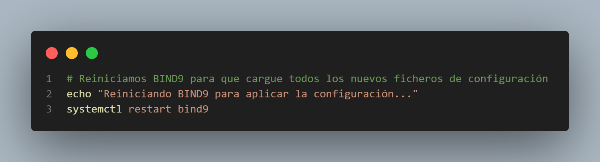

> Esta linea significa que al copiar el ultimo fichero se reiniciara el servicio (_bind9_).

Ahora si comenzamos la explicacion de la configuracion de un servidor FTP.

## 1. Configuracion inicial

Como estamos reutilizando la maquina DNS de la practica anterior la ip ya esta configurada _(192.168.56.8)_ y el nombre de dominio tambien _(mluna.test)_ a si que vamos a pasar a configurar el DNS

- ### 1.1 Configuracion DNS 

Ahora vamos a hacer que el DNS sepa quien es ftp.mluna.test. La practica pide que ftp.example.com sea un alias. Nosotros haremos lo mismo: ftp.mluna.test será un alias de nuestro servidor debian.mluna.test

 - **Actualizacion del Fichero de Zona Directa**

 Editamos nuestro fichero config/mluna.test.dns y le añadimos una sola línea al final para el CNAME

 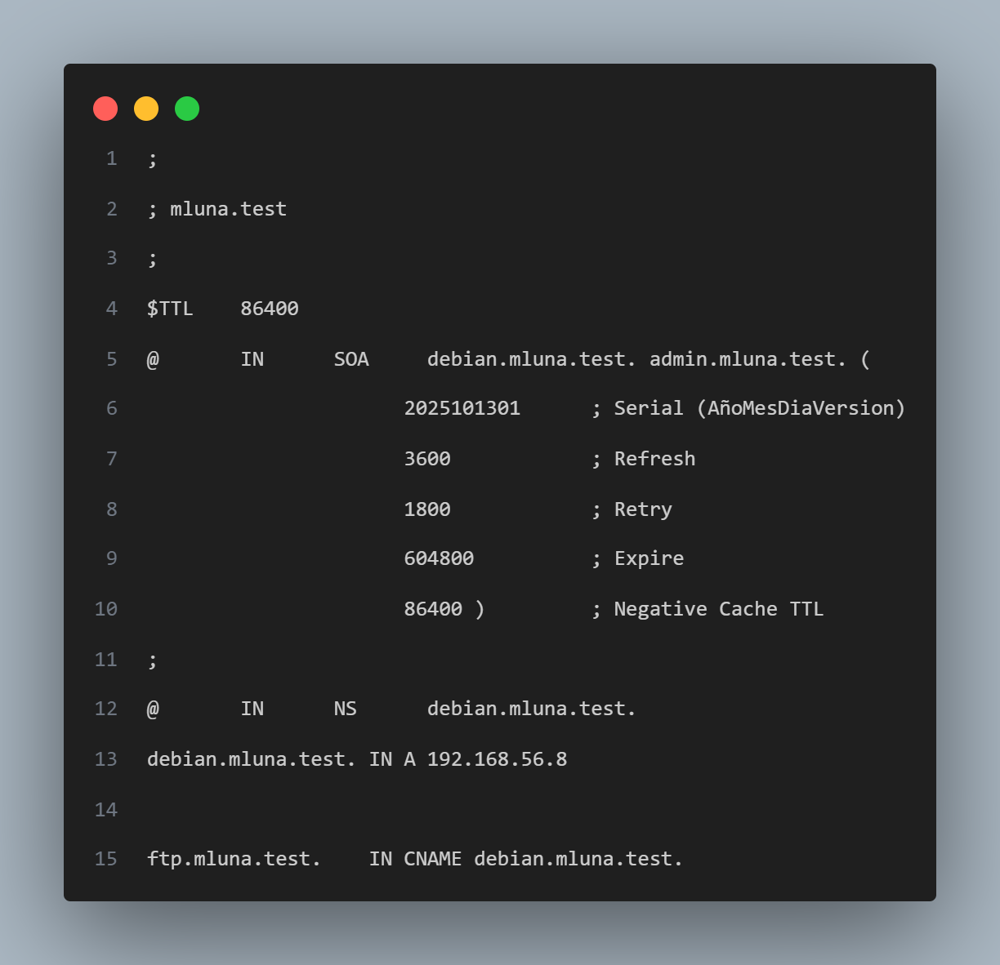

 Validamos que no hemos roto nada, apagando y encendiendo la maquina para que se apliquen los cambios:

 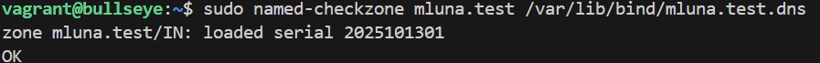

 > Como vemos nos da el OK por lo que funciona

 - **Actualización del bootstrap.sh**

 Ahora tenemos que decirle al bootstrap.sh que instale el programa del servidor FTP (vsftpd).

 Editamos el bootstrap.sh y en la línea donde instalamos BIND9, añadimos vsftpd:

 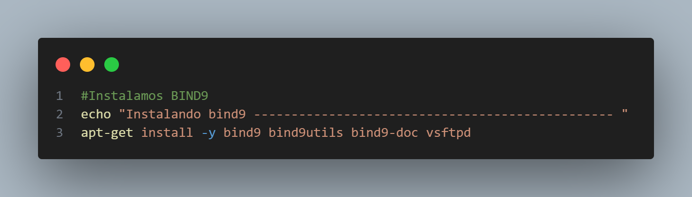

 - **Comprobacion del DNS**

 Para aplicar todos estos cambios, lanzamos el provision desde nuestra terminal:

 ```
 vagrant provision
 ```

 Una vez echo el provision comprobamos que funcione desde nuestro anfitrion:

 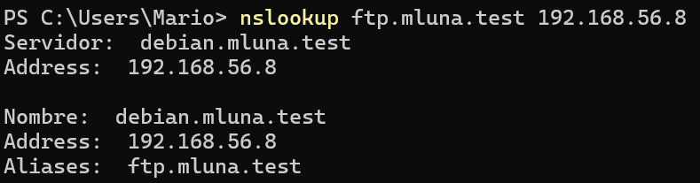

## 2. Configuracion inicial

 - **1. Instalacion cliente _(FileZilla)_**

 Vamos a usar FileZilla, que es el más famoso, gratis y fácil de usar

 1. Entramos en la web oficial (filezilla-project.org)

 2. Descargamos el instalador para Windows e instalamos (Dale a "Siguiente" a todo)

 Ahora que tenemos el FileZilla lo abrimos y empezamos con los siguientes pasos

 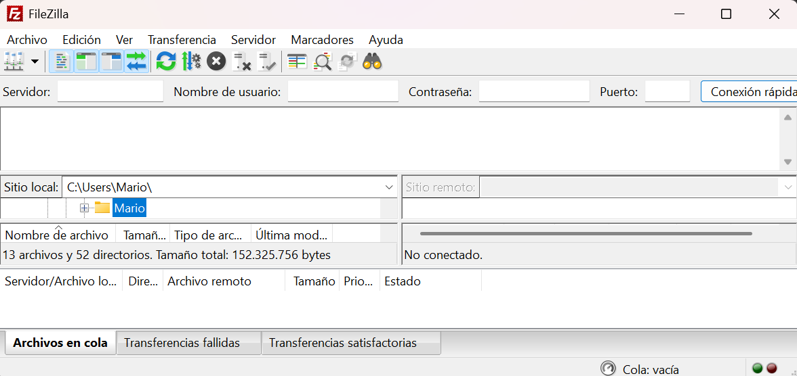

 - **2. Preparamos los archivos del PC**

 La practica nos pide crear una carpeta _pruebasFTP_ con un fichero llamado _datos1.txt_

 

 Ahora escribimos lo que sea en el documento de texto

 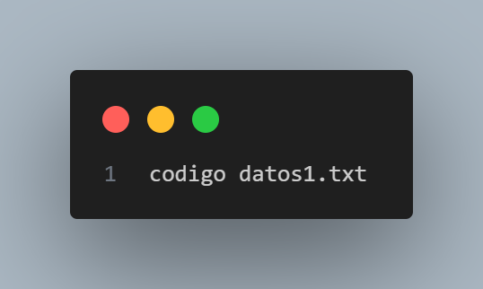

 - **3. Nos conectamos a ftp.cica.es**

 En FileZilla nos vamos a conexion rapida y lo rellenamos con lo siguiente:

 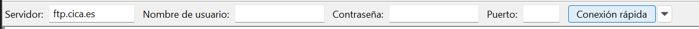

 > Usuario y contraseña los dejamos en blanco para que sea conexion anonima

 Ahora al darle al boton de conexion rapido veremos que estamos conectados a cica 

 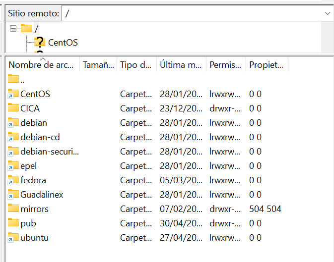

 - **4. Descargar el fichero**

 En el panel de la derecha ("Sitio remoto"), buscamos la carpeta pub y hacemos doble clic en ella.

 

 Dentro de pub buscamos el fichero que se llama check

 

 Hacemos doble clic sobre el fichero check.

 Ahora veremos que se descarga y aparece en tu panel izquierdo _(carpeta pruebasFTP)_

 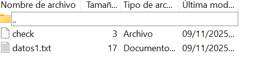

 - **5. Intentar subir un fichero**

 Pinchamos en _datos1.txt_ y lo arrastramos al panel de la derecha _(servidor)_ y veremos el siguiente fallo

 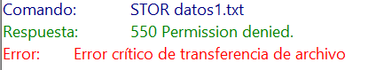

 > Este fallo se debe a que no tenemos permisos al habernos conectado de manera anonima

 Una vez comprobado nos desconactamod del servidro cica (En la barra de herramientas buscamos _Servidor_ le damos y se despliege un menu y le clickamos a _Desconectar_)

## 3. Instalación y configuración del servidor vsftpd sobre Linux

Como en el primer paso ya lo hemos echo (instalacion de vsftpd) en el primer paso vamos por lo siguiente

- ### 3.1 Creacion de Usuario y Ficheros en _bootstrap.sh_

Vamos a añadir al _bootstrap.sh_ los comandos para que cree automáticamente los usuarios (luis, maria, miguel) y sus ficheros de prueba

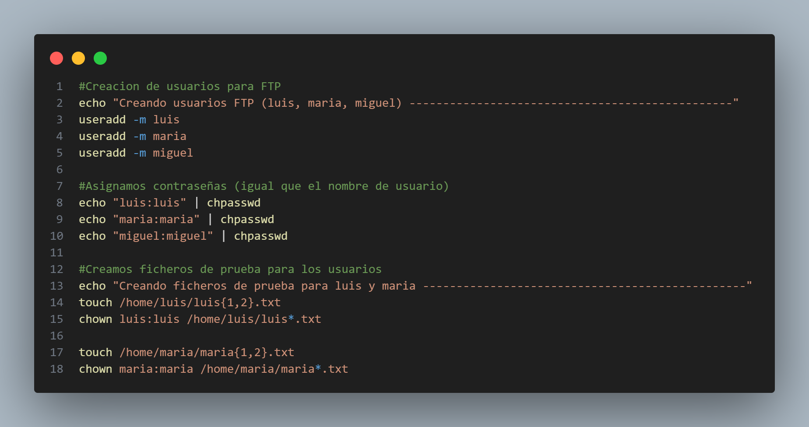

- ### 3.2 Creacion del Fichero _config/vsftpd.conf_

Vamos a la carpeta config y creamos un nuevo fichero llamado _vsftpd.conf_ y dentro de este escribmos lo siguiente:

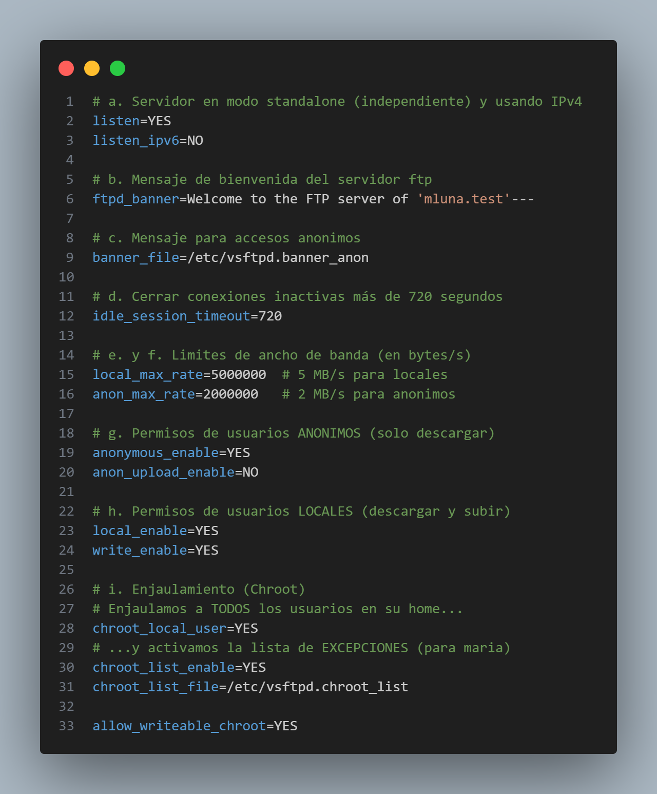

